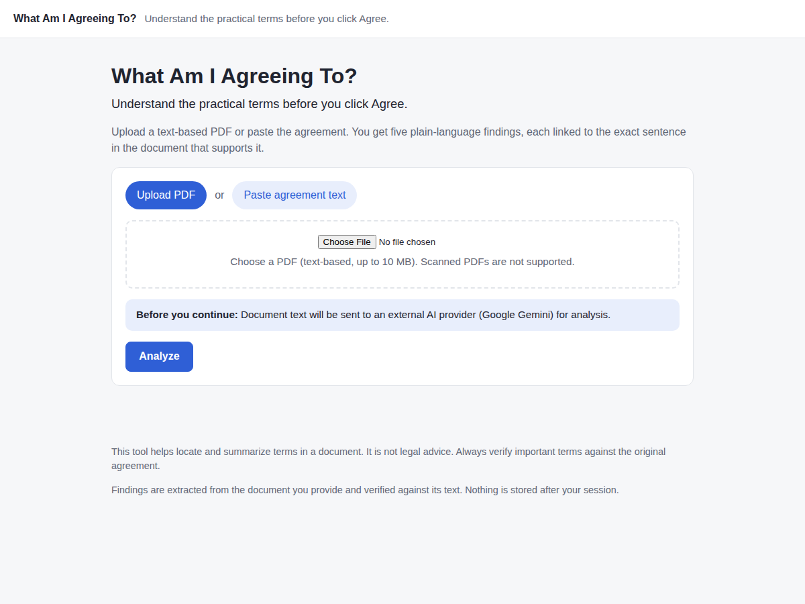
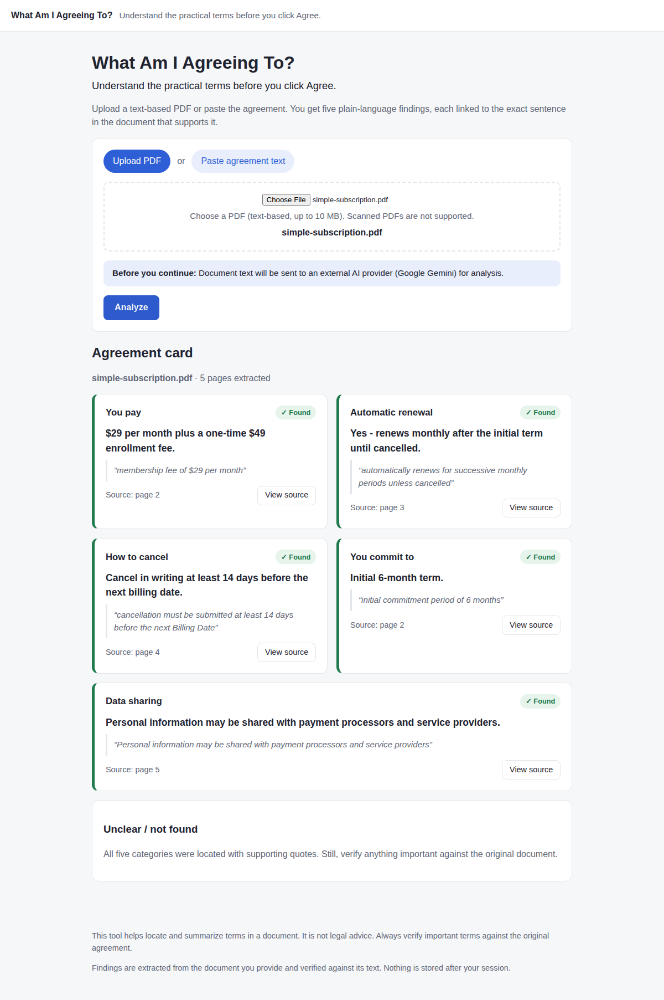
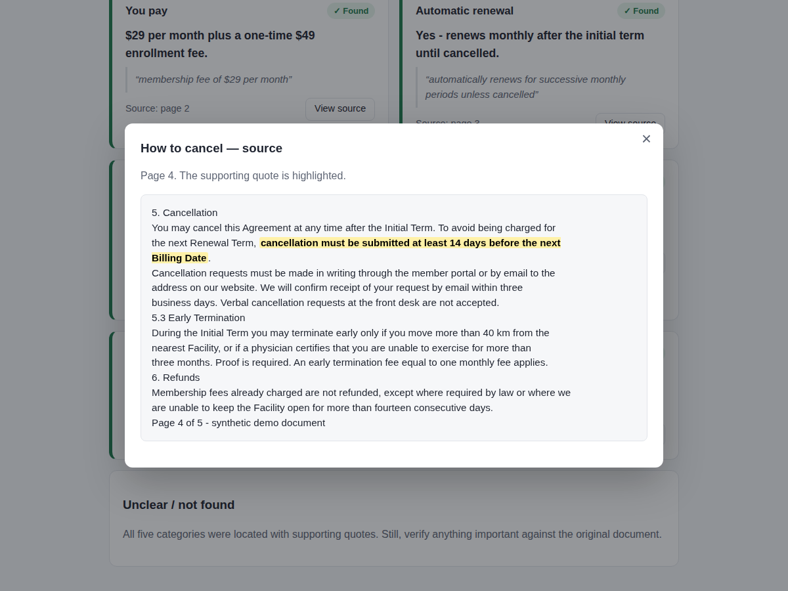
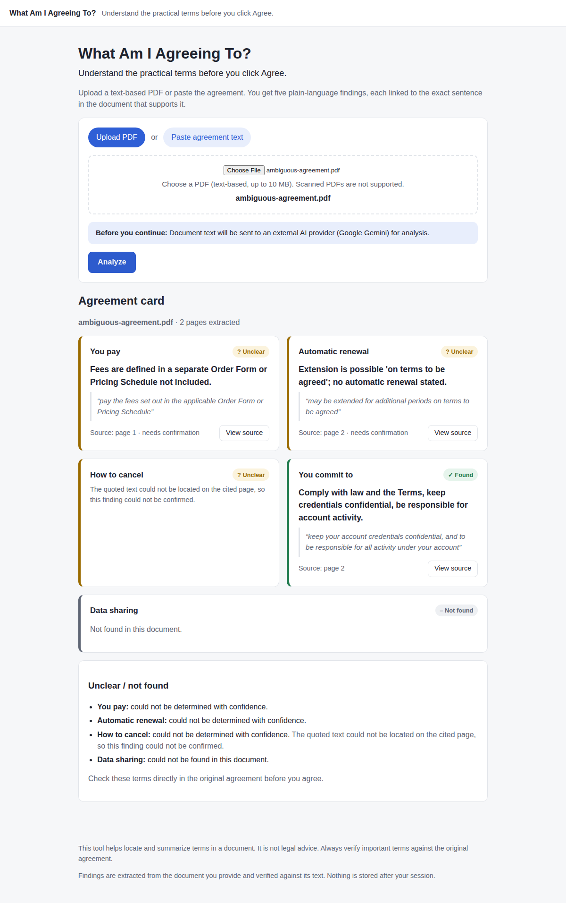

# What Am I Agreeing To?

**Understand the terms that matter before you click "I Agree."**

```text
Agreement
    ↓
What Am I Agreeing To?
    ↓
Payment
Renewal
Cancellation
Commitment
Data sharing
    ↓
Every finding linked back to source evidence
```

Upload a subscription agreement, membership contract, waiver or terms-of-service PDF (or paste
the text) and get a five-point card answering the questions people actually have: *What will I
pay? Does it renew? How do I cancel? What am I committing to? Can they share my data?* Every
answer is a short quote from the document, with a link to the page it came from.

> AI extracts candidate findings. The application independently verifies that the cited
> evidence exists in the source document. If the quote is not there, the finding is not shown
> as fact.

---

## Problem

"By clicking *I Agree* you accept the Terms…" - and the Terms are 10 to 30 pages. Nobody reads
them, but almost everybody has the same five practical questions. Generic PDF summarisers answer
the wrong question (what is this document about?) and are happy to invent details. This tool
answers only the practical questions, only from the document, and shows its work.

## Features

- **Fixed five-point agreement card** - *You pay*, *Automatic renewal*, *How to cancel*,
  *You commit to*, *Data sharing* - plus an explicit *Unclear / not found* section.
  No free-form AI sections.
- **Evidence for every finding.** A FOUND status is only possible with a verbatim quote and a
  page number. Click *View source* to see the extracted page with the quote highlighted.
- **Deterministic evidence validation.** The quote returned by the AI is checked against the
  extracted text of the cited page (whitespace-, quote- and case-normalised). Fabricated or
  misplaced quotes are rejected and the finding is downgraded to UNCLEAR.
- **Three honest statuses**: `FOUND`, `UNCLEAR`, `NOT_FOUND`. No fake confidence percentages.
- **Extraction, not advice.** The AI is instructed never to judge the agreement; an additional
  filter strips summaries that slip into advice ("you should not sign", "this is unfair").
- **Page-aware PDF extraction** (pdfplumber) for text-based PDFs; plain-text paste as an
  alternative. Scanned PDFs are detected and rejected with a clear message - no unreliable OCR.
- **Graceful AI failure.** Missing key, quota exhausted, timeout, provider outage or a
  malformed response never crash the app; the extracted text is still shown.
- **Privacy first.** External-AI notice before upload; document text is never logged; nothing
  is persisted - results live in memory for 30 minutes so the source viewer can work.
- **Swappable AI layer** (`app/services/ai/`): the Gemini provider is one implementation of a
  small protocol.

## Screenshots

Captured from the running app with the bundled synthetic documents (the AI step was served by the
deterministic stub provider from `tests/conftest.py`, so the findings are the expected ones).

| Home | Agreement card | Source viewer |
| --- | --- | --- |
|  |  |  |

Ambiguous document → `UNCLEAR` instead of a made-up answer:



## Quick Start

Requirements: Python 3.12+, a Gemini API key (free tier works).

```bash
git clone https://github.com/VsevaTech/what-am-i-agreeing-to.git
cd what-am-i-agreeing-to
python -m venv .venv && source .venv/bin/activate
pip install -e ".[dev]"

cp .env.example .env          # then put your key into GEMINI_API_KEY
uvicorn app.main:app --reload
```

Open <http://127.0.0.1:8000>, upload `examples/simple-subscription.pdf`, click **Analyze**.

Without a key the app still starts: documents are extracted and shown, and the card area
explains that AI analysis is unavailable.

## Gemini setup

1. Create a key at <https://aistudio.google.com/apikey> (Gemini Developer API, free tier).
2. Put it in `.env`:

   ```dotenv
   GEMINI_API_KEY=your-key
   GEMINI_MODEL=gemini-2.5-flash
   ```

   `GEMINI_MODEL` can be any Gemini Flash model your key can access; the model name is read
   from this single setting and is not hard-coded anywhere else.
3. `.env` is git-ignored. Never commit it. Only `.env.example` is tracked.

The provider uses Gemini's structured output (`response_mime_type="application/json"` with the
`AgreementAnalysis` Pydantic schema), so the model cannot answer in free-form Markdown.

## Docker

```bash
cp .env.example .env   # add GEMINI_API_KEY
docker compose up --build
# → http://127.0.0.1:8000
```

The image runs as an unprivileged user and writes nothing to disk. `docker compose` reads
`.env` if present; the app works (extraction only) without it.

## How evidence validation works

```text
extracted pages ──► Gemini (structured JSON) ──► AgreementAnalysis
                                                      │
                          for each of the 5 findings   ▼
                          ┌──────────────────────────────────────────┐
                          │ status == FOUND but no evidence?  → UNCLEAR│
                          │ page number not in document?      → UNCLEAR│
                          │ quote not on that page (normalised)? → UNCLEAR│
                          │ quote longer than 600 chars?       → UNCLEAR│
                          │ summary contains advice?  → summary removed│
                          └──────────────────────────────────────────┘
                                                      │
                                                      ▼
                                             VerifiedAnalysis → UI
```

`app/services/evidence_validator.py` normalises both the quote and the page text (collapse
whitespace, unify curly quotes/dashes, ignore case) and then searches the page with a
whitespace-tolerant regular expression. The match span is reused by the source viewer to
highlight the quote in the original page text, so what you see highlighted is exactly what was
verified. The AI is never the source of truth - the uploaded document is.

The critical test in `tests/test_evidence_validator.py` feeds the validator an AI result that
claims *"Cancellation requires 30 days notice."* with an identical "quote" that does not exist
in the document. Expected: evidence rejected, status `UNCLEAR`, claim never displayed as fact.

## Privacy

- Before analysis the page states: *Document text will be sent to an external AI provider
  (Google Gemini) for analysis.*
- The application logs only document kind, page count, character count and whether AI
  succeeded - never the document, the extracted text or the API key.
- No database. Analysed documents are held in process memory for `RESULT_TTL_SECONDS`
  (default 30 minutes) so *View source* can work, then dropped.
- All bundled demo documents are synthetic. Do not commit real agreements.

## Architecture

```text
app/
├── main.py                     FastAPI routes (thin) + create_app()
├── config.py                   pydantic-settings; env vars only
├── models/
│   ├── agreement.py            Status, Finding, AgreementAnalysis (AI schema), VerifiedAnalysis
│   └── document.py             Page, ExtractedDocument (page markers for the prompt)
├── services/
│   ├── document_extractor.py   PDF (pdfplumber) / plain text → pages; error taxonomy
│   ├── evidence_validator.py   deterministic quote verification + highlight spans
│   ├── analysis.py             extract → AI → validate orchestration; never raises on AI errors
│   ├── result_store.py         in-memory TTL store for the source viewer
│   └── ai/
│       ├── base.py             AIProvider protocol, error classes, extraction-only system prompt
│       ├── gemini.py           Gemini structured-output implementation
│       └── factory.py          builds the provider from settings
├── templates/                  Jinja2 (index, result, partials: result / source / error)
└── static/                     style.css, vendored htmx
tests/                          pytest, no network, Gemini SDK client mocked
examples/                       synthetic demo PDFs + build_examples.py (reproducible)
```

Stack: Python 3.12, FastAPI, Pydantic v2, Jinja2, HTMX, pdfplumber, google-genai, pytest,
ruff, Docker. Deliberately absent: React, databases, queues, auth, vector stores, RAG
frameworks - a 30-page agreement fits in one structured LLM call.

## Tests

```bash
pytest -q          # 69 tests, no API key needed
ruff check . && ruff format --check .
```

Coverage: PDF extraction and page numbering; plain-text input; empty / image-only / invalid /
oversized PDFs; valid structured AI output and all three statuses; evidence present, whitespace
normalisation, fabricated quote rejected, wrong page rejected, missing evidence; missing API
key, timeout, quota / API errors, invalid Gemini responses; HTTP flow including the source
viewer and the graceful "AI unavailable" path.

## Demo documents

| File | What it demonstrates |
| --- | --- |
| `examples/simple-subscription.pdf` | Fictional gym membership: $29/month, automatic monthly renewal, 14-day cancellation notice, 6-month initial commitment, data shared with payment processor and service providers. All five findings `FOUND`. |
| `examples/ambiguous-agreement.pdf` | Fictional SaaS terms: fees "as set out in the Order Form", renewal "on terms to be agreed", cancellation "per then-current policy", no data-sharing clause. Expect `UNCLEAR` / `NOT_FOUND`, not invented answers. |
| `examples/no-renewal-agreement.pdf` | Fictional one-time course enrollment: single $480 payment, explicitly does not renew. |

Regenerate with `python examples/build_examples.py` (output is byte-for-byte reproducible;
CI checks this).

### Live demo walkthrough

```bash
docker compose up --build
```

1. Upload `simple-subscription.pdf` → five `FOUND` cards: *$29 per month*, *renews monthly*,
   *14 days before the billing date*, *6-month initial term*, *payment processors and service
   providers*, each with **View source**.
2. Click **View source** on *How to cancel* → page 4 of the extracted text with the sentence
   *"cancellation must be submitted at least 14 days before the next Billing Date"* highlighted.
3. Upload `ambiguous-agreement.pdf` → `UNCLEAR` for fees, renewal and cancellation;
   `NOT_FOUND` for data sharing.

## Limitations

- Text-based PDFs only. Scanned / image-only PDFs are rejected; there is no OCR.
- Extraction quality depends on the PDF's text layer (multi-column layouts, tables and
  footnotes may be flattened oddly by pdfplumber).
- Five fixed categories. Refund terms, liability, arbitration and other clauses are out of scope
  for this MVP.
- One LLM call per document; documents beyond `MAX_AI_CHARS` (200k characters) are truncated
  for the AI step. `MAX_PAGES` (60) and `MAX_UPLOAD_MB` (10) are enforced.
- The validator proves that a quote exists on the cited page; it cannot prove that the summary
  is a correct reading of that quote. Read the highlighted text yourself.
- English-language prompt and UI. Other languages may work but are untested.
- In-memory result store: results disappear on restart and are per-process.

## Disclaimer

This tool helps locate and summarize terms in a document. It is not legal advice. Always verify
important terms against the original agreement.

## License

MIT - see [LICENSE](LICENSE).
