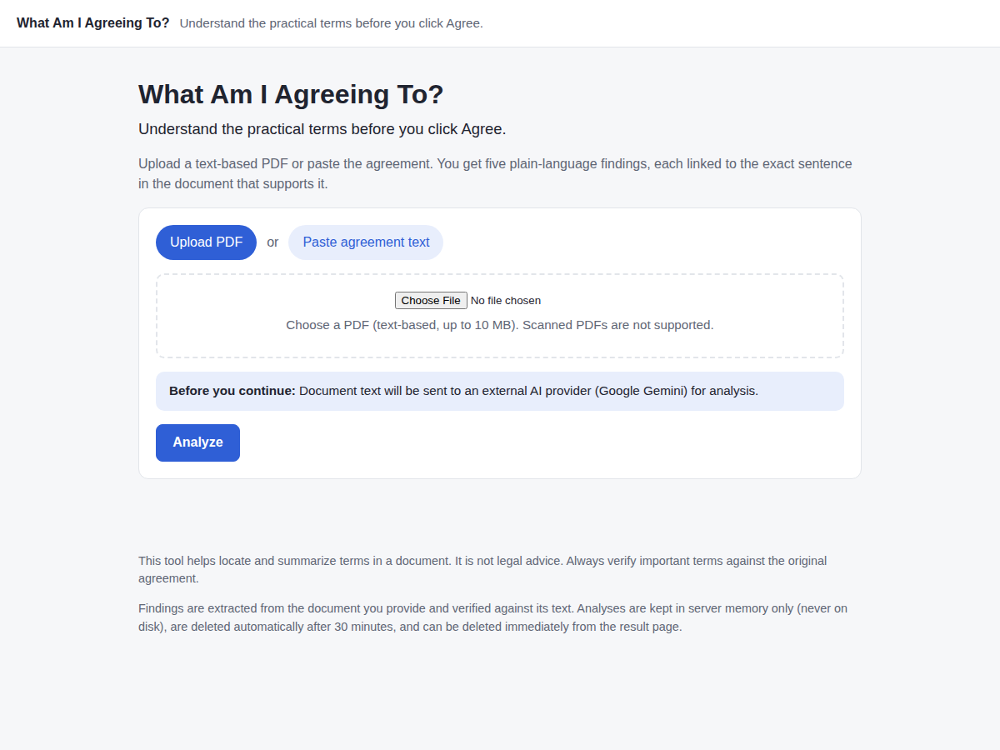
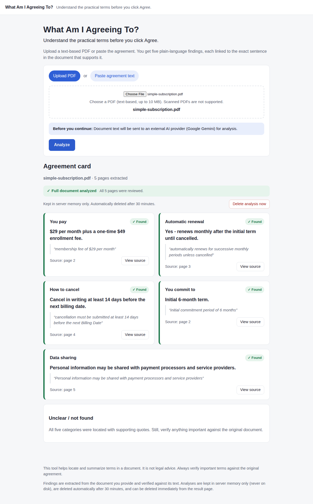
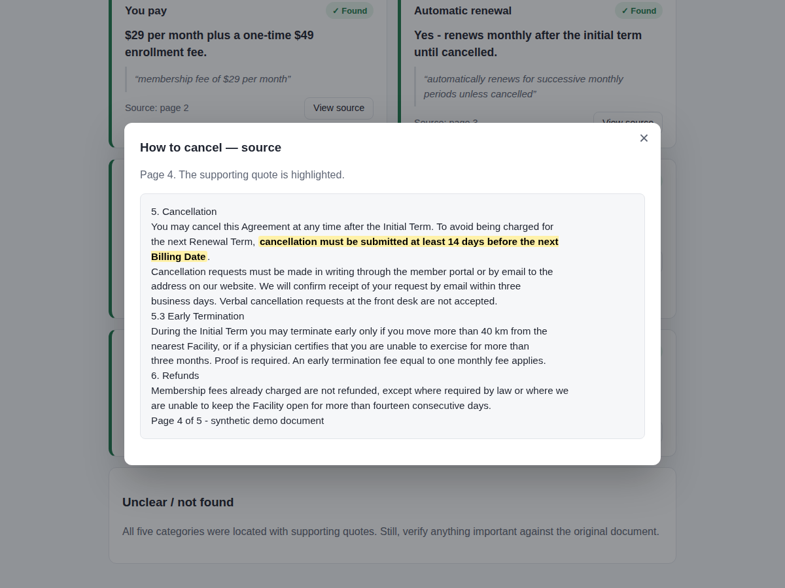
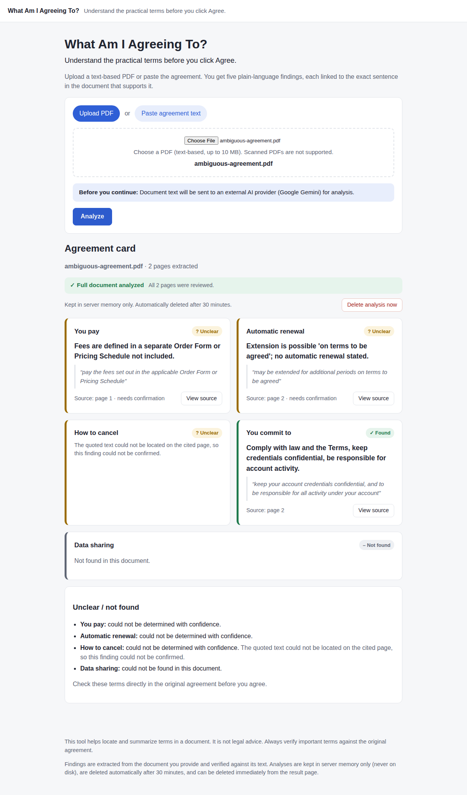

# What Am I Agreeing To?

**Understand the terms that matter before you click "I Agree."**

```text
Agreement
    ↓
What Am I Agreeing To?
    ↓
Payment
Renewal
Cancellation
Commitment
Data sharing
    ↓
Every finding linked back to source evidence
```

Upload a subscription agreement, membership contract, waiver or terms-of-service PDF (or paste
the text) and get a five-point card answering the questions people actually have: *What will I
pay? Does it renew? How do I cancel? What am I committing to? Can they share my data?* Every
answer is a short quote from the document, with a link to the page it came from.

> AI extracts candidate findings. The application independently verifies that the cited
> evidence exists in the source document. If the quote is not there, the finding is not shown
> as fact.

---

## Problem

"By clicking *I Agree* you accept the Terms…" - and the Terms are 10 to 30 pages. Nobody reads
them, but almost everybody has the same five practical questions. Generic PDF summarisers answer
the wrong question (what is this document about?) and are happy to invent details. This tool
answers only the practical questions, only from the document, and shows its work.

## Features

- **Fixed five-point agreement card** - *You pay*, *Automatic renewal*, *How to cancel*,
  *You commit to*, *Data sharing* - plus an explicit *Unclear / not found* section.
  No free-form AI sections.
- **Evidence for every finding.** A FOUND status is only possible with a verbatim quote and a
  page number. Click *View source* to see the extracted page with the quote highlighted.
- **Deterministic evidence validation.** The quote returned by the AI is checked against the
  extracted text of the cited page (whitespace-, quote- and case-normalised). Fabricated or
  misplaced quotes are rejected and the finding is downgraded to UNCLEAR.
- **Three honest statuses**: `FOUND`, `UNCLEAR`, `NOT_FOUND`. No fake confidence percentages.
- **Extraction, not advice.** The AI is instructed never to judge the agreement; an additional
  filter strips summaries that slip into advice ("you should not sign", "this is unfair").
- **Page-aware PDF extraction** (pdfplumber) for text-based PDFs; plain-text paste as an
  alternative. Scanned PDFs are detected and rejected with a clear message - no unreliable OCR.
- **Graceful AI failure.** Missing key, quota exhausted, timeout, provider outage or a
  malformed response never crash the app; the extracted text is still shown.
- **Honest coverage.** Every result says whether the *full document* was analyzed or only a
  part of it ("Reviewed pages 1–37 of 52"). A term that was not found in a partially analyzed
  document is reported as `UNCLEAR`, never `NOT_FOUND`.
- **Privacy first.** External-AI notice before upload; document text is never logged; nothing
  is persisted - results live in memory for 30 minutes so the source viewer can work, and
  **Delete analysis now** removes them immediately.
- **Swappable AI layer** (`app/services/ai/`): the Gemini provider is one implementation of a
  small protocol.

## Screenshots

Captured from the running app with the bundled synthetic documents (the AI step was served by the
deterministic stub provider from `tests/conftest.py`, so the findings are the expected ones).

| Home | Agreement card | Source viewer |
| --- | --- | --- |
|  |  |  |

Ambiguous document → `UNCLEAR` instead of a made-up answer:



## Quick Start

Requirements: Python 3.12+, a Gemini API key (free tier works).

```bash
git clone https://github.com/VsevaTech/what-am-i-agreeing-to.git
cd what-am-i-agreeing-to
python -m venv .venv && source .venv/bin/activate
pip install -e ".[dev]"

cp .env.example .env          # then put your key into GEMINI_API_KEY
uvicorn app.main:app --reload
```

Open <http://127.0.0.1:8000>, upload `examples/simple-subscription.pdf`, click **Analyze**.

Without a key the app still starts: documents are extracted and shown, and the card area
explains that AI analysis is unavailable.

## Gemini setup

1. Create a key at <https://aistudio.google.com/apikey> (Gemini Developer API, free tier).
2. Put it in `.env`:

   ```dotenv
   GEMINI_API_KEY=your-key
   GEMINI_MODEL=gemini-2.5-flash
   ```

   `GEMINI_MODEL` can be any Gemini Flash model your key can access; the model name is read
   from this single setting and is not hard-coded anywhere else.
3. `.env` is git-ignored. Never commit it. Only `.env.example` is tracked.

The provider uses Gemini's structured output (`response_mime_type="application/json"` with the
`AgreementAnalysis` Pydantic schema), so the model cannot answer in free-form Markdown.

## Docker

```bash
cp .env.example .env   # add GEMINI_API_KEY
docker compose up --build
# → http://127.0.0.1:8000
```

The image runs as an unprivileged user and writes nothing to disk. `docker compose` reads
`.env` if present; the app works (extraction only) without it.

## How evidence validation works

```text
extracted pages ──► Gemini (structured JSON) ──► AgreementAnalysis
                                                      │
                          for each of the 5 findings   ▼
                          ┌──────────────────────────────────────────┐
                          │ status == FOUND but no evidence?  → UNCLEAR│
                          │ page not in the analyzed range?    → UNCLEAR│
                          │ quote not on that page (normalised)? → UNCLEAR│
                          │ quote longer than 600 chars?       → UNCLEAR│
                          │ summary contains advice?  → summary removed│
                          └──────────────────────────────────────────┘
                                                      │
                          partial analysis and NOT_FOUND?  → UNCLEAR
                                                      │
                                                      ▼
                                             VerifiedAnalysis → UI
```

`app/services/evidence_validator.py` normalises both the quote and the page text (collapse
whitespace, unify curly quotes/dashes, ignore case) and then searches the page with a
whitespace-tolerant regular expression. The match span is reused by the source viewer to
highlight the quote in the original page text, so what you see highlighted is exactly what was
verified. The AI is never the source of truth - the uploaded document is.

The critical test in `tests/test_evidence_validator.py` feeds the validator an AI result that
claims *"Cancellation requires 30 days notice."* with an identical "quote" that does not exist
in the document. Expected: evidence rejected, status `UNCLEAR`, claim never displayed as fact.

## Large documents

The whole document goes to the AI in one call, bounded by `MAX_AI_CHARS` (default 200,000
characters of prompt text). **When a document exceeds the configured AI input limit, the UI shows
exactly how much was analyzed. Terms not found in the analyzed portion are reported as UNCLEAR
rather than NOT_FOUND.**

How it works (`ExtractedDocument.select_for_ai`, `app/services/analysis.py`):

- The application - never the model - decides coverage. Whole pages are added in order while
  the prompt stays within the limit; the first page that would overflow and every page after it
  are left out. Pages are not cut in the middle. Only when a single page is larger than the limit
  (typically pasted plain text without page breaks) is that page cut, at a word boundary.
- The result carries `Coverage`: `total_pages`, `analyzed_pages`, `total_chars`,
  `analyzed_chars`, and `partial`.
- The UI shows either **✓ Full document analyzed** or **⚠ Partial analysis - Reviewed pages
  1–37 of 52. The remaining pages were not analyzed.**
- Rules applied after evidence validation:

  | Coverage | AI says | Shown as |
  | --- | --- | --- |
  | full | `NOT_FOUND` | `NOT_FOUND` |
  | partial | `NOT_FOUND` | `UNCLEAR` - *not found in the analyzed portion of the document* |
  | partial | `FOUND` with a verified quote from pages 1–37 | `FOUND` |
  | partial | `FOUND` citing page 48 (not sent to the AI) | `UNCLEAR` - quote rejected |

- Evidence is validated against exactly the text that was sent to the AI, so a quote from a page
  (or the unread part of a page) the model never saw cannot be confirmed - even if it happens to
  exist in the upload.

The tool therefore does **not** claim to have reviewed a document it only partly read. There is
no chunking, multi-pass analysis or retrieval: if the important clause is beyond the limit, you
are told to check the rest yourself.

## Privacy / retention

- Before analysis the page states: *Document text will be sent to an external AI provider
  (Google Gemini) for analysis.*
- The application logs only document kind, page / character counts (total and analyzed) and
  whether AI succeeded - never the document, the extracted text, result tokens or the API key.
- No database, nothing written to disk. Each analysis (extracted text, pages, findings, quotes,
  metadata) is one object in the in-memory `ResultStore`, kept for `RESULT_TTL_SECONDS`
  (default 30 minutes) so *View source* and the result URL (`/results/{token}`) work, then
  dropped automatically.
- Responses that contain a result or document text (`/analyze`, `/results/…`, `/source/…`) are
  sent with `Cache-Control: no-store, private`, so the browser does not keep them in its cache.
  Static assets are cached normally.
- All bundled demo documents are synthetic. Do not commit real agreements.

### Delete analysis now

Every result page has a **Delete analysis now** button (with a one-click confirmation). It sends
`POST /results/{token}/delete`, which removes the whole analysis from the store and redirects to
the start page with an *Analysis deleted* confirmation. Afterwards the old result URL and every
*View source* link return 404. Deleting an analysis that was already deleted or has expired is
safe. Deletion never happens on `GET`.

Note: this removes the server's copy. Text already sent to the AI provider for analysis is
subject to that provider's own data policy.

## Architecture

```text
app/
├── main.py                     FastAPI routes (thin) + create_app()
├── config.py                   pydantic-settings; env vars only
├── models/
│   ├── agreement.py            Status, Finding, AgreementAnalysis (AI schema), VerifiedAnalysis
│   └── document.py             Page, ExtractedDocument, Coverage (AI input selection)
├── services/
│   ├── document_extractor.py   PDF (pdfplumber) / plain text → pages; error taxonomy
│   ├── evidence_validator.py   deterministic quote verification + highlight spans
│   ├── analysis.py             extract → AI → validate orchestration; never raises on AI errors
│   ├── result_store.py         in-memory TTL store (+ delete) for result / source views
│   └── ai/
│       ├── base.py             AIProvider protocol, error classes, extraction-only system prompt
│       ├── gemini.py           Gemini structured-output implementation
│       └── factory.py          builds the provider from settings
├── templates/                  Jinja2 (index, result, partials: result / source / error)
└── static/                     style.css, vendored htmx
tests/                          pytest, no network, Gemini SDK client mocked
examples/                       synthetic demo PDFs + build_examples.py (reproducible)
scripts/                        check_examples.py (CI asset check), smoke.sh (E2E),
                                demo_partial.py (coverage + delete demo), screenshots
```

Stack: Python 3.12, FastAPI, Pydantic v2, Jinja2, HTMX, pdfplumber, google-genai, pytest,
ruff, Docker. Deliberately absent: React, databases, queues, auth, vector stores, RAG
frameworks - a typical agreement fits in one structured LLM call, and a longer one is reported
as partially analyzed instead of silently truncated.

## Tests

```bash
pytest -q                         # 112 tests, no API key needed
ruff check . && ruff format --check .
python scripts/check_examples.py  # demo PDFs regenerate to exactly the committed files
```

Coverage: PDF extraction and page numbering; plain-text input; empty / image-only / invalid /
oversized PDFs; valid structured AI output and all three statuses; evidence present, whitespace
normalisation, fabricated quote rejected, wrong page rejected, missing evidence; missing API
key, timeout, quota / API errors, invalid Gemini responses; HTTP flow including the source
viewer and the graceful "AI unavailable" path; coverage (small / exact-limit / over-limit /
plain text), `NOT_FOUND` → `UNCLEAR` on partial analysis, quotes outside the analyzed range, a
regression document whose cancellation clause sits after the cutoff; delete / TTL / isolation
between analyses; `Cache-Control` on real responses.

### CI

`.github/workflows/ci.yml` runs on push to `main`, pull requests and manual dispatch
(*Run workflow*): lint → demo-asset reproducibility (`scripts/check_examples.py` regenerates the
PDFs and fails with a readable message if Git sees any change) → tests → Docker build → container
smoke test (`scripts/smoke.sh`: analyze, result URL, delete, 404 afterwards, headers). The
*Regenerate demo assets* workflow commits regenerated files with `GITHUB_TOKEN`, which does not
trigger `push` workflows, so it dispatches CI for its own commit explicitly; neither workflow
triggers the other in a loop.

## Demo documents

| File | What it demonstrates |
| --- | --- |
| `examples/simple-subscription.pdf` | Fictional gym membership: $29/month, automatic monthly renewal, 14-day cancellation notice, 6-month initial commitment, data shared with payment processor and service providers. All five findings `FOUND`. |
| `examples/ambiguous-agreement.pdf` | Fictional SaaS terms: fees "as set out in the Order Form", renewal "on terms to be agreed", cancellation "per then-current policy", no data-sharing clause. Expect `UNCLEAR` / `NOT_FOUND`, not invented answers. |
| `examples/no-renewal-agreement.pdf` | Fictional one-time course enrollment: single $480 payment, explicitly does not renew. |
| `examples/no-cancellation-terms.pdf` | 12 pages, fits the AI limit completely, and has no cancellation clause at all → **Full document analyzed**, *How to cancel* `NOT_FOUND`. |
| `examples/long-subscriber-agreement.pdf` | 52 pages, exceeds the default limit: pages 1–37 are analyzed. The cancellation clause is on page 48 and the renewal clause on page 49 → **Partial analysis**, both `UNCLEAR`, while fee (p. 2), minimum term (p. 3) and data sharing (p. 4) are `FOUND`. |

Regenerate with `python examples/build_examples.py` (output is byte-for-byte reproducible;
CI checks this).

### Live demo walkthrough

```bash
docker compose up --build
```

1. Upload `simple-subscription.pdf` → five `FOUND` cards: *$29 per month*, *renews monthly*,
   *14 days before the billing date*, *6-month initial term*, *payment processors and service
   providers*, each with **View source**.
2. Click **View source** on *How to cancel* → page 4 of the extracted text with the sentence
   *"cancellation must be submitted at least 14 days before the next Billing Date"* highlighted.
3. Upload `ambiguous-agreement.pdf` → `UNCLEAR` for fees, renewal and cancellation;
   `NOT_FOUND` for data sharing.
4. Upload `no-cancellation-terms.pdf` → **✓ Full document analyzed**, *How to cancel*:
   Not found.
5. Upload `long-subscriber-agreement.pdf` → **⚠ Partial analysis - Reviewed pages 1–37 of 52**,
   *How to cancel*: Unclear, *not found in the analyzed portion*.
6. Click **Delete analysis now** → *Analysis deleted*; the old result URL and source links now
   return 404.

Without an API key, `python scripts/demo_partial.py` runs steps 4–6 against the real app with a
deterministic keyword stub (it only sees the pages the app sends it) and prints the checks.

## Limitations

- Text-based PDFs only. Scanned / image-only PDFs are rejected; there is no OCR.
- Extraction quality depends on the PDF's text layer (multi-column layouts, tables and
  footnotes may be flattened oddly by pdfplumber).
- Five fixed categories. Refund terms, liability, arbitration and other clauses are out of scope
  for this MVP.
- One LLM call per document. Documents beyond `MAX_AI_CHARS` (200k characters) are analyzed
  only partly - the UI says so and unresolved terms become `UNCLEAR` (see *Large documents*).
  `MAX_PAGES` (60) and `MAX_UPLOAD_MB` (10) are enforced.
- The validator proves that a quote exists on the cited page; it cannot prove that the summary
  is a correct reading of that quote. Read the highlighted text yourself.
- English-language prompt and UI. Other languages may work but are untested.
- In-memory result store: results disappear on restart and are per-process.

## Disclaimer

This tool helps locate and summarize terms in a document. It is not legal advice. Always verify
important terms against the original agreement.

## License

MIT - see [LICENSE](LICENSE).
